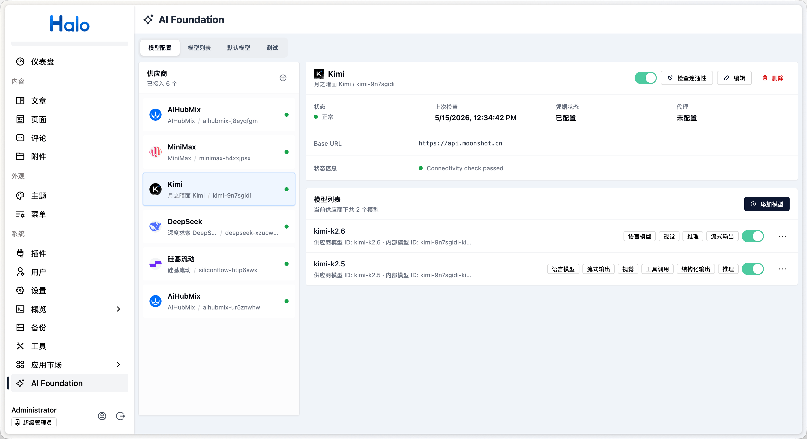
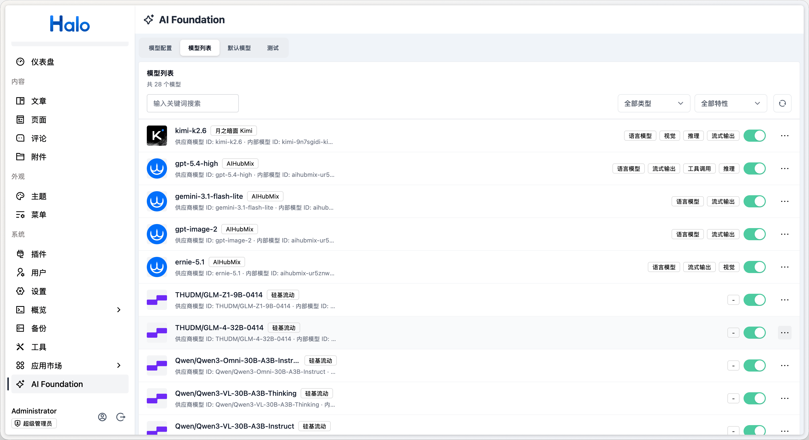
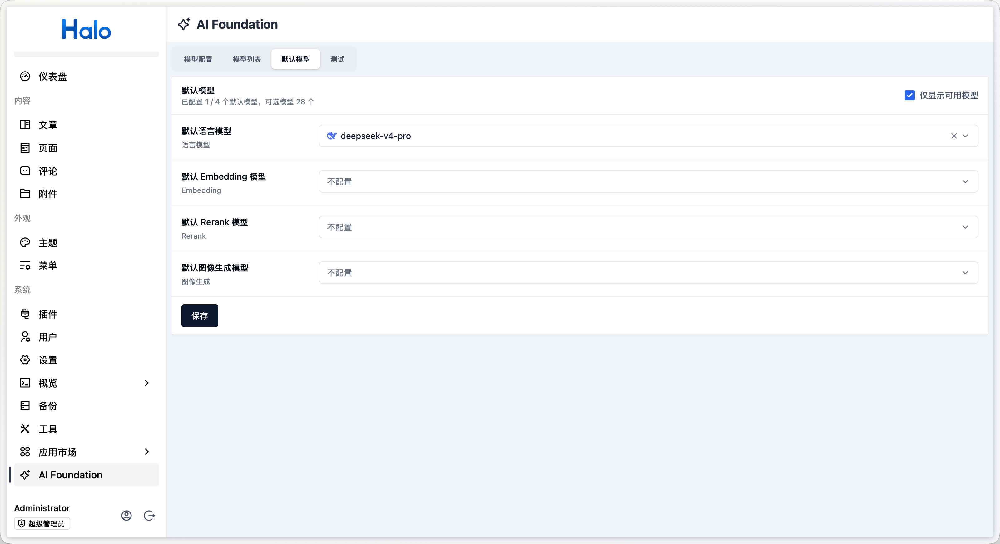
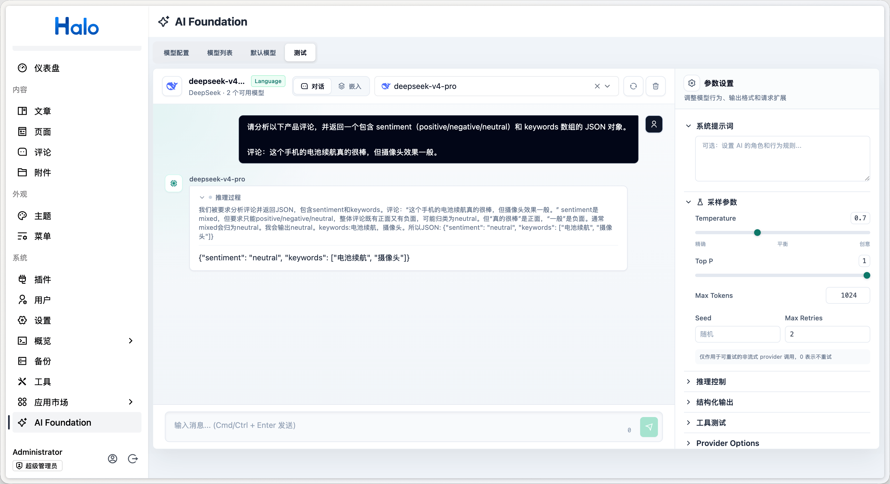

# Halo AI Foundation

Halo 官方 AI 能力平台，统一接入主流大模型，为插件生态提供文本生成、嵌入向量、工具调用等智能化能力。



## 功能特性

- **多提供商支持**：内置 OpenAI、DeepSeek、Kimi（Moonshot）、SiliconFlow、豆包、文心一言、智谱 AI、Ollama、OpenAI-like、AIHubMix、Gitee 模力方舟、MiniMax、Xiaomi MiMo 等主流 AI 提供商
- **统一模型管理**：通过 Halo 控制台统一管理 AI 提供商和模型配置
- **模型自动发现**：支持从提供商自动拉取可用模型列表
- **流式对话**：支持 SSE 流式输出，适用于实时聊天场景
- **工具调用**：支持模型调用外部工具，适用于复杂任务编排
- **文本嵌入**：支持文本向量化，适用于语义搜索、RAG 等场景
- **默认模型设置**：支持配置系统默认的语言模型和嵌入模型
- **模型测试 Playground**：内置测试页面，支持验证文本生成、流式输出、工具调用、结构化输出等
- **Java SDK**：通过 `api` 模块为其他 Halo 插件提供标准化的 AI 调用接口

## 已接入插件

- [AI 回评](https://www.halo.run/store/apps/app-mo5tivjt)
- [Live2d 看板娘](https://www.halo.run/store/apps/app-oPNFQ)

## 界面预览








## 项目结构

本项目为多模块 Gradle 项目：

| 模块   | 说明                                                                                         |
| ------ | -------------------------------------------------------------------------------------------- |
| `api/` | 对外发布的 Java SDK（`run.halo.aifoundation:api`）。其他 Halo 插件依赖此模块即可调用 AI 能力 |
| `app/` | 插件实现模块。包含 Extension 定义、提供商类型、Endpoint、Service 实现和 RBAC 配置            |
| `ui/`  | 基于 Vue 3 + Rsbuild 的控制台界面，用于提供商和模型的可视化管理                              |

## 开发环境

- Java 21
- Node.js 24
- pnpm
- Docker（`haloServer` 开发服务器需要）

## 开发

```bash
# 1. 启动 Halo 开发服务器（会自动构建并加载插件）
./gradlew haloServer

# 2. 启动前端开发服务器
cd ui && pnpm install && pnpm dev
```

开发服务器启动后，访问 `http://127.0.0.1:8090/console/`（默认账号 admin / admin）即可在控制台中看到「Ai Foundation」菜单。

修改后端代码后，重载插件：

```bash
./gradlew reloadPlugin
```

修改后端 API 或字段后，重新生成前端 API 客户端：

```bash
./gradlew generateApiClient
```

## 构建

```bash
# 完整构建（后端 + 前端 + 测试）
./gradlew build

# 仅编译检查
./gradlew compileJava

# 运行测试
./gradlew test
```

构建完成后，插件 JAR 文件位于 `app/build/libs/` 目录。

## 其他插件集成

其他 Halo 插件可以通过依赖 `api` 模块来调用本插件提供的 AI 能力，包括文本生成、流式输出、工具调用、文本嵌入和结构化输出等。

本插件还提供了前端 `AiModelSelector` 组件，供其他插件在设置页中直接选择已配置的 AI 模型。

详细集成说明请参考 [dev/dev.md](./dev/dev.md)。

## 许可证

[GPL-3.0](./LICENSE) © Halo
