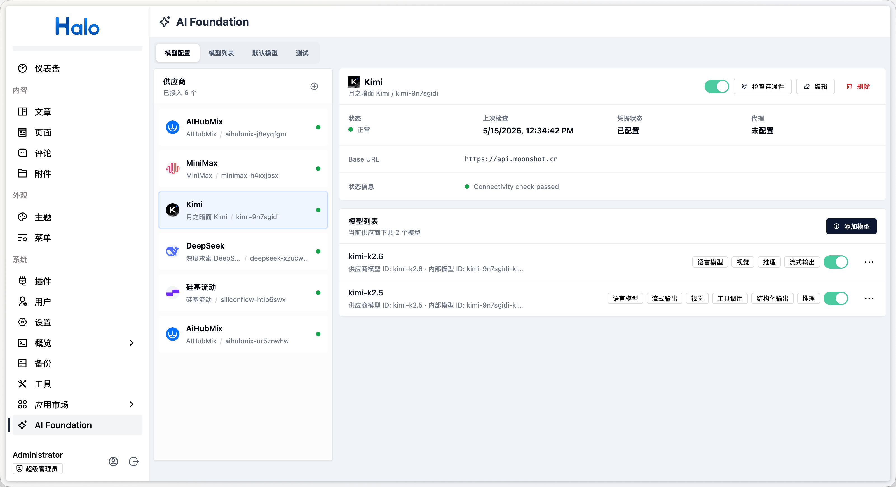
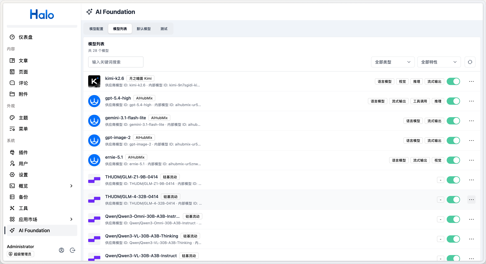
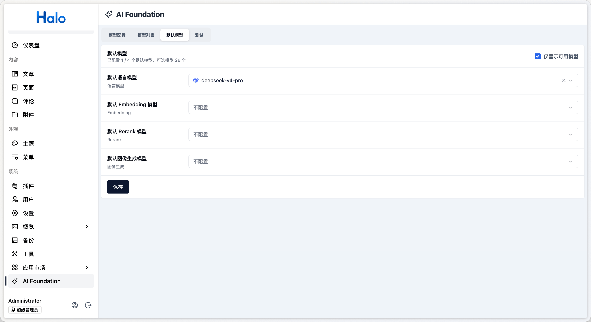
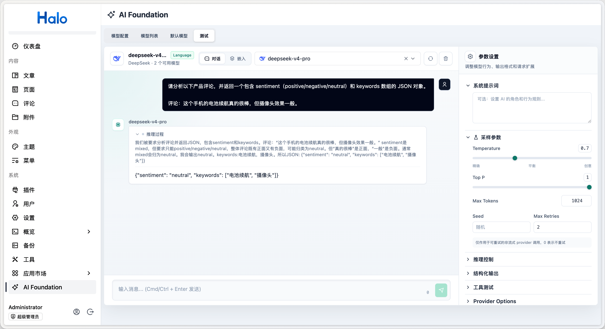

# Halo AI Foundation

[简体中文](./README.md) | English

Halo's official AI capability platform. It provides unified access to popular AI providers and
shared capabilities such as text generation, embeddings, and tool calling for the Halo plugin
ecosystem.



## Features

- **Multiple AI providers**: Built-in support for OpenAI, OpenRouter, DeepSeek, Moonshot Kimi,
  SiliconFlow, Alibaba Cloud Model Studio, Doubao, ERNIE, Zhipu AI, Ollama, OpenAI-compatible
  providers, AIHubMix, Gitee AI, MiniMax, and Xiaomi MiMo
- **Unified model management**: Manage providers, API key secrets, language, embedding, reranking,
  and image models, adapters, and model capabilities from the Halo Console
- **Model discovery**: Fetch available models from providers while retaining the source of remote
  declarations, built-in capabilities, and administrator overrides
- **Parameter mapping**: Configure provider- or model-level mappings for sampling, retries,
  reasoning, embedding, reranking, and image parameters
- **Text and multimodal generation**: Generate text with streaming or non-streaming responses,
  image and file inputs, reasoning content, sources, structured output, and multi-step results
- **Tool calling**: Use server-side and external tools, streamed tool input, approval, input repair,
  parallel tool calls, and step controls
- **Embeddings, reranking, and RAG**: Create embeddings, process batches, calculate similarity,
  rerank results, and compose retrieval, reranking, and context-injection middleware
- **Image generation**: Generate and edit images with masks, aggregate multiple images, and apply
  image middleware
- **UI Message Stream**: Use a persistable message protocol, SSE responses, message validation and
  conversion, cancellation, and frontend tool continuation
- **Default models**: Configure separate default models for language, embedding, reranking, and
  image generation
- **Model playground**: Validate chat, embeddings, reranking, image generation, and single-turn RAG
  while inspecting stream events, usage, warnings, and diagnostics
- **Consumer SDKs**: Use a provider-neutral Java API, a browser/Vue npm package, and the FormKit
  `aiModelSelector`

## Plugins using AI Foundation

- [AI Review Reply](https://www.halo.run/store/apps/app-mo5tivjt)
- [Live2D Widget](https://www.halo.run/store/apps/app-oPNFQ)
- [AI Assistant](https://www.halo.run/store/apps/app-OWBzA)
- [Comment Widget Next](https://www.halo.run/store/apps/app-p8xona4f)
- [Qingyan](https://www.halo.run/store/apps/app-cmisffbv)

## Screenshots








## Project structure

This repository is a multi-module Gradle project:

| Module | Description                                                                                                                        |
| ------ | ---------------------------------------------------------------------------------------------------------------------------------- |
| `api/` | Published Java SDK (`run.halo.aifoundation:api`) used by other Halo plugins to access AI capabilities                              |
| `app/` | Plugin implementation containing Extension definitions, provider types, endpoints, service implementations, and RBAC configuration |
| `ui/`  | Console interface built with Vue 3 and Rsbuild for visually managing providers and models                                          |

## Prerequisites

- Java 21
- Node.js 24
- pnpm
- Docker, required by the `haloServer` development server

## Development

```bash
# 1. Start the Halo development server.
# It builds and loads the plugin automatically.
./gradlew haloServer

# 2. Start the frontend development server.
cd ui && pnpm install && pnpm dev
```

After the development server starts, open `http://127.0.0.1:8090/console/` and sign in with the
default credentials, `admin` / `admin`. The **AI Foundation** menu will be available in the
Console.

Reload the plugin after changing backend code:

```bash
./gradlew reloadPlugin
```

Regenerate the frontend API client after changing backend API endpoints or fields:

```bash
./gradlew generateApiClient
```

## Build

```bash
# Full build: backend, frontend, and tests
./gradlew build

# Compile only
./gradlew compileJava

# Run tests
./gradlew test
```

The plugin JAR is generated in `app/build/libs/`.

## Integration with other plugins

Other Halo plugins can depend on the `api` module to use language, embedding, reranking, image
generation, RAG, and UI Message capabilities.

AI Foundation also registers the FormKit `aiModelSelector` input so that plugins can select
configured models from their settings forms.

- [SDK Core](./dev/en/sdk-core/README.md): Java APIs for text generation, tools, structured output,
  embeddings, reranking, RAG, image generation, middleware, and error handling
- [SDK UI](./dev/en/sdk-ui/README.md): Vue chat, message persistence, tool interaction, completion,
  object streams, transport, and the UI Message protocol
- [Plugin integration examples](./dev/en/plugin-integration-examples.md): Plugin dependencies,
  backend model calls, UI Message endpoints, Vue chat, and model settings

The [SDK Core single-page reference](./dev/en/dev.md) and
[UI Message Stream single-page reference](./dev/en/ui-message-stream.md) are suited to full-text
lookup.

## AI-assisted development

The repository provides a distributable
[`use-ai-foundation-sdk`](./skills/use-ai-foundation-sdk/SKILL.md) Skill. Install it in a project
with the [Skills CLI](https://skills.sh/docs/cli):

```bash
npx skills add halo-dev/plugin-ai-foundation --skill use-ai-foundation-sdk
```

To install it globally for Codex:

```bash
npx skills add halo-dev/plugin-ai-foundation --skill use-ai-foundation-sdk --global --agent codex
```

After installation, invoke it with `$use-ai-foundation-sdk`. The Skill resolves the SDK version
used by the target plugin, reuses installed Java or npm artifacts when available, and pulls the
matching official repository only when more documentation or source context is needed.

## License

[GPL-3.0](./LICENSE) © Halo
